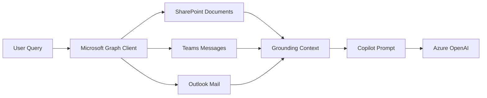

# Microsoft 365 Copilot Graph RAG

A TypeScript starter showing a Copilot-style retrieval workflow using Microsoft Graph concepts across SharePoint, Teams, and Outlook.

## Why This Project Matters

This project maps directly to enterprise AI developer work involving:

- Copilot configuration and extensibility
- Microsoft Graph
- SharePoint, Teams, and Outlook integrations
- Retrieval augmented generation
- Enterprise permission boundaries
- Prompt grounding

## Architecture



## Quick Start

```powershell
npm install
npm run build
npm start
```

## Environment Variables

```text
TENANT_ID=replace-me
CLIENT_ID=replace-me
CLIENT_SECRET=replace-me
AZURE_OPENAI_ENDPOINT=https://your-resource.openai.azure.com/
AZURE_OPENAI_DEPLOYMENT=gpt-4o-mini
```

## Portfolio Talking Point

This project demonstrates how I think about Microsoft 365 Copilot-style grounding: retrieve only permission-aware content, cite sources, and pass compact evidence into an enterprise prompt.

